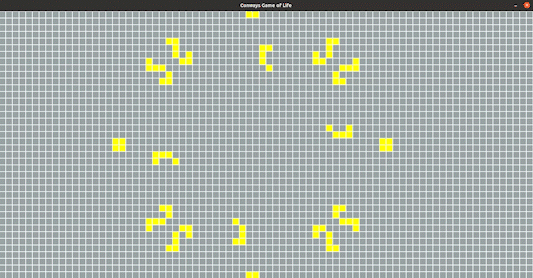
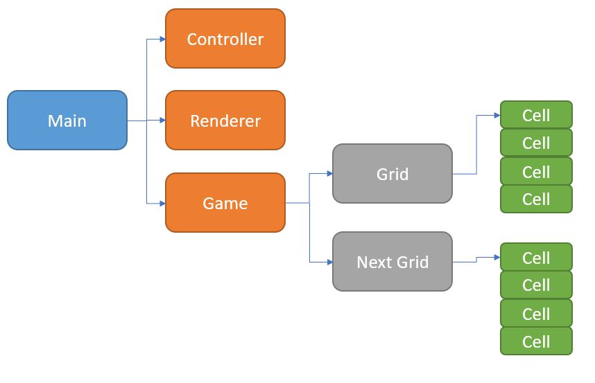

# Conway's Game of Life

Implementation of [Conway's Game of life] (https://en.wikipedia.org/wiki/Conway%27s_Game_of_Life) as imagined by John Conway.

  *Disclaimer: Game of life is supposedly run on an infinite Grid
   The Grid in this program is not infinite, but everything else works the same way

The code for this repo was inspired by [this] (https://github.com/udacity/CppND-Capstone-Snake-Game) Udacity starter code 

This program allows you to simulate cellular automatas within Conway's Defined Rules.

Click a Cell to change toggle its state between Life and Death.

Rules:
* 1: Any live cell with two or three live neighbours survives.
* 2: Any dead cell with three live neighbours becomes a live cell.
* 3: All other live cells die in the next generation. Similarly, all other dead cells stay dead.

You can use one of the following four patterns in the lexicon, or store your own creations!

List of patterns:
* 1: Jason Summers eight-barrel glider gun
* 2: Achim's p144 
* 3: 86P5H1V1 spaceship
* 4: 101 Demonoid
* 5: Available
* 6: Available
* 7: Available
* 8: Available
* 9: Available
* 0: Available

Patterns 1 to 4 can also be overwritten.

Have Fun!

## Code Structure

## Controls

* Grid Movement
  * Up Arrow---------------------->: Move grid up
  * Down Arrow-------------------->: Move grid down
  * Left Arrow-------------------->: Move grid to the left
  * Right Arrow------------------->: Move grid to the right

  * w----------------------------->: Grid Zoom in
  * s----------------------------->: Grid Zoom out

* Game control
  * Enter------------------------->: Start/Pause
  * j----------------------------->: Accelerate game speed
  * k----------------------------->: Decelerate game speed
  * m----------------------------->: Take a step forward (Game must be paused to perfim this action)

* Loading/storing patterns (Game must be paused to perfim this action)
  * Numbers 0 to 9---------------->: Load the corresponing pattern from file
  * Numbers 0 to 9 + Right Shift-->: Store Pattern in corresponding file

## File Descriptions

* main.cpp     : Program main
* utils.h      : Common variables and helper functions
* game.h       : Controls the game loop, as well as creating, destruction and update of grids
* controller.h : Handles input from the user
* renderer.h   : Methods for rendering the grid
* cell.h       : Represents a cell in the grid

## Dependencies for Running Locally
* cmake >= 3.7
  * All OSes: [click here for installation instructions](https://cmake.org/install/)
* make >= 4.1 (Linux, Mac), 3.81 (Windows)
  * Linux: make is installed by default on most Linux distros
  * Mac: [install Xcode command line tools to get make](https://developer.apple.com/xcode/features/)
  * Windows: [Click here for installation instructions](http://gnuwin32.sourceforge.net/packages/make.htm)
* SDL2 >= 2.0
  * All installation instructions can be found [here](https://wiki.libsdl.org/Installation)
  >Note that for Linux, an `apt` or `apt-get` installation is preferred to building from source. 
* gcc/g++ >= 5.4
  * Linux: gcc / g++ is installed by default on most Linux distros
  * Mac: same deal as make - [install Xcode command line tools](https://developer.apple.com/xcode/features/)
  * Windows: recommend using [MinGW](http://www.mingw.org/)

## Basic Build Instructions

1. Clone this repo.
2. Make a build directory in the top level directory: `mkdir build && cd build`
3. Compile: `cmake .. && make`
4. Run it: `./Game_of_life`.

## CC Attribution-ShareAlike 4.0 International

Shield: [![CC BY-SA 4.0][cc-by-sa-shield]][cc-by-sa]

This work is licensed under a
[Creative Commons Attribution-ShareAlike 4.0 International License][cc-by-sa].

[![CC BY-SA 4.0][cc-by-sa-image]][cc-by-sa]

[cc-by-sa]: http://creativecommons.org/licenses/by-sa/4.0/
[cc-by-sa-image]: https://licensebuttons.net/l/by-sa/4.0/88x31.png
[cc-by-sa-shield]: https://img.shields.io/badge/License-CC%20BY--SA%204.0-lightgrey.svg
